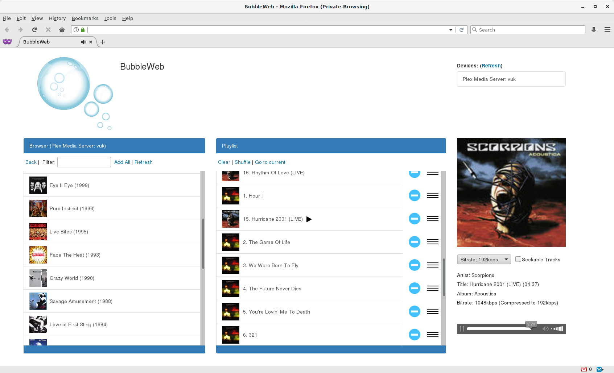

# What this is?
This is a web client for BubbleUPnP Server. It uses HTML5 &lt;audio&gt; and &lt;video&gt; tags to play server's contents.
Currently it supports browsing the server, managing a playlist and playing.

# Requirements
1. A BubbleUPnP Server installed with active DLNA server behind it.
2. A PHP-capable (with cURL support) web-server.

# Installation
1. Clone the repository to somewhere accessible by your web server.
2. Run:
    cp config.inc.dist.php config.inc.php
    cp config.inc.dist.js config.inc.js
3. 
  Edit config.inc.php with server details
  Edit config.inc.js with UI preferences.
  

# Screenshot

